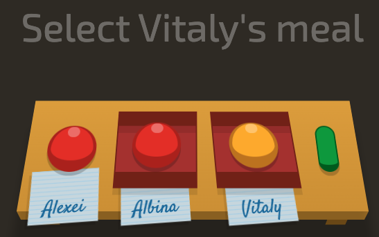

### Descrição:

Complete o jogo <a href="http://flukeout.github.io" target="_blank">CSS Diner</a>

Gostou? Não esqueça de avaliar o exercício:

<a class="btn" href="https://forms.gle/scs1VxDDFSiMqAhe8" target="_blank"> Abra o formulário de avaliação</a>
